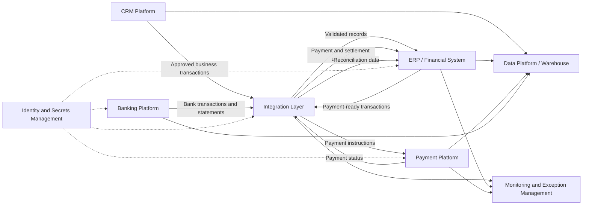
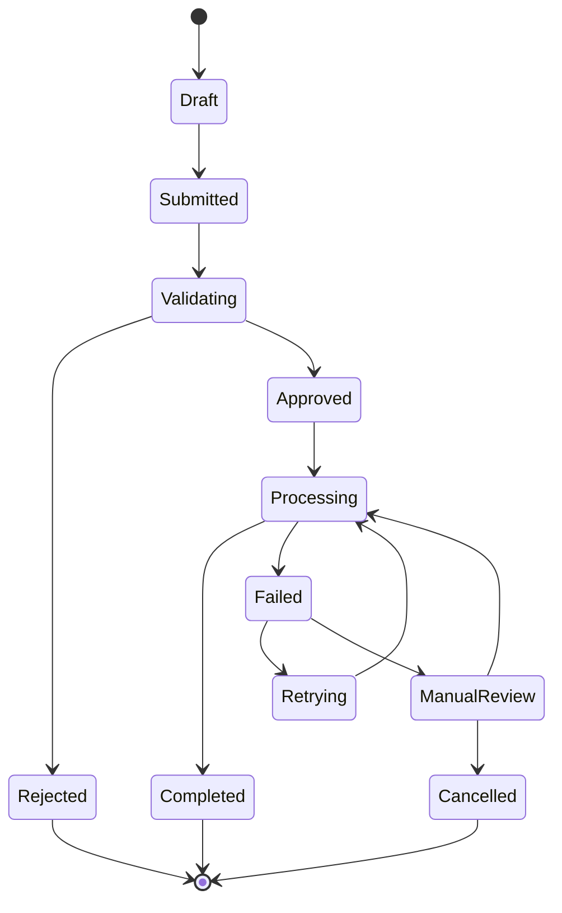

# Enterprise Integration Reference Architecture

A vendor-neutral reference architecture for designing secure, reliable, and maintainable integrations across enterprise applications, data platforms, financial systems, and external services.

This repository demonstrates how I approach complex integration problems—from defining system boundaries and data ownership to designing synchronization, reconciliation, monitoring, security, and exception-handling patterns.

> **Note:** All organizations, systems, data, identifiers, and business scenarios in this repository are fictional or generalized. No proprietary employer code, confidential information, credentials, or production data are included.

**Live demo:** [CRM → ERP Payment Simulator](https://egovender.github.io/Evani/) — an interactive, browser-only walkthrough of the CRM-to-ERP payment workflow described below.

---

## Overview

Modern organizations often rely on multiple platforms to manage customers, financial transactions, payments, reporting, operations, and compliance.

These systems may include:

- Customer relationship management platforms
- Enterprise resource planning systems
- Payment and banking platforms
- Data warehouses and analytics tools
- Human resources and payroll systems
- Document management platforms
- Third-party APIs and external service providers

The difficult part is not simply connecting these systems. A dependable integration must also answer questions such as:

- Which system owns each data element?
- What happens when a transaction fails?
- How are duplicates prevented?
- How are records reconciled across systems?
- How are updates processed in the correct order?
- How are changes monitored and audited?
- How is sensitive information protected?
- How can the solution be supported after implementation?

This repository provides reusable patterns for addressing those questions.

---

## Architecture Goals

The reference architecture is designed around the following goals:

- Clear system and data ownership
- Reliable movement of data between applications
- Strong validation before transactions are processed
- Idempotent operations that prevent duplicate records
- Traceable transactions and audit history
- Automated retry and exception-handling processes
- Reconciliation between source and target systems
- Secure management of credentials and sensitive data
- Monitoring that supports both technical and business teams
- Loose coupling between systems wherever practical
- Documentation that supports long-term maintenance

---

## High-Level Architecture



The architecture is intentionally vendor-neutral. Individual components can be implemented using commercial integration platforms, cloud services, custom APIs, ETL tools, event-processing services, or a combination of technologies.

---

## Example Business Scenario

The repository uses a fictional organization that manages vendors, financial approvals, invoices, payments, and reporting across several systems.

A typical process may follow this sequence:

1. A vendor or payee is created in the CRM.
2. Required information is validated.
3. An approved vendor record is synchronized to the ERP.
4. The payment platform completes onboarding and compliance checks.
5. Payability status is returned to the CRM and ERP.
6. An approved invoice or payment request is created.
7. The ERP sends the payment-ready transaction to the payment platform.
8. Payment status is returned to the ERP.
9. Settlement information is received from the bank.
10. Transactions are reconciled and exceptions are routed for review.
11. Operational and financial data is loaded into the reporting platform.

---

## Core Integration Patterns

### API-Based Integration

Used when systems require near-real-time communication.

Common examples include:

- Creating or updating master data
- Validating a record before approval
- Retrieving current status
- Submitting a financial transaction
- Returning an external system identifier

### Batch and File-Based Integration

Used when systems exchange large volumes of data on a schedule.

Common examples include:

- Bank statement files
- Payroll files
- Historical data migration
- Daily financial extracts
- Bulk reconciliation data

### Event-Driven Integration

Used when downstream systems should respond to business events without tight coupling.

Example events include:

- Vendor approved
- Payment authorized
- Invoice created
- Payment failed
- Settlement received
- Record changed

### Request and Response Integration

Used when the originating system requires an immediate result before continuing.

For example:

```text
CRM submits approved transaction
        ↓
Integration layer validates request
        ↓
ERP creates transaction
        ↓
ERP returns internal identifier
        ↓
CRM stores identifier and updates status
```

### Asynchronous Processing

Used for operations that may take longer or depend on external processing.

The initiating system receives an acknowledgement, while final status is returned later through an event, webhook, scheduled process, or status query.

---

## Data Ownership

Every integrated field should have a clearly defined system of record.

| Data Area | Example System of Record | Downstream Consumers |
|---|---|---|
| Customer or partner profile | CRM | ERP, reporting platform |
| Vendor accounting record | ERP | CRM, payment platform |
| Payment onboarding status | Payment platform | CRM, ERP |
| Invoice and journal data | ERP | Reporting platform |
| Payment execution status | Payment platform | ERP, CRM |
| Bank settlement data | Banking platform | ERP, reporting platform |
| Analytical metrics | Data platform | Dashboards and reports |

Data ownership should be defined at the field level when multiple systems contribute to the same business object.

---

## Integration Control Framework

### Validation

Transactions should be validated before they are sent downstream.

Example checks include:

- Required values are present
- Reference values are valid
- The record is in an approved status
- The source identifier is unique
- Amounts are greater than zero
- Transaction dates are within an allowed period
- The vendor or customer is active
- The target system mapping exists

### Idempotency

Each transaction should contain a stable external identifier.

Before creating a record, the target system or integration layer should determine whether that identifier has already been processed.

This prevents duplicates when:

- A process is retried
- A user submits the same request twice
- A timeout occurs after the target system created the record
- A scheduled job reprocesses an earlier file

### Retry Management

Temporary failures may be retried automatically.

Examples include:

- Network timeouts
- API rate limits
- Temporary service outages
- Locked records
- Delayed downstream processing

Retries should use:

- A maximum retry count
- Increasing delay intervals
- Clear retry status
- Final escalation after retries are exhausted

### Exception Management

Failures that cannot be resolved automatically should be added to an exception queue.

Each exception should capture:

- Source system
- Target system
- Transaction identifier
- Date and time
- Error category
- Error message
- Retry count
- Current owner
- Resolution status
- Resolution notes

### Reconciliation

Reconciliation confirms that records were transferred completely and accurately.

Common reconciliation controls include:

- Source count versus target count
- Source amount versus target amount
- Duplicate transaction checks
- Missing external identifiers
- Failed or incomplete records
- Payment amount versus settlement amount
- File control totals
- Daily and monthly balance comparisons

---

## Status Management

Integrated workflows should use a controlled status model.

An example transaction lifecycle is:



Statuses should distinguish between:

- Business approval status
- Technical processing status
- Payment or settlement status
- Exception-resolution status

Combining all of these into one field can make troubleshooting and reporting difficult.

---

## Security Considerations

The architecture follows these general security principles:

- Never store credentials in source code
- Use a secrets-management service
- Encrypt data in transit
- Encrypt sensitive data at rest
- Apply least-privilege access
- Use service accounts for system integrations
- Rotate credentials regularly
- Mask sensitive information in logs
- Validate webhook signatures
- Restrict inbound traffic where possible
- Maintain audit logs for material changes
- Separate development, testing, and production environments

Example secret configuration:

```bash
ERP_API_URL=https://example.internal/api
ERP_CLIENT_ID=stored-in-secret-manager
ERP_CLIENT_SECRET=stored-in-secret-manager
```

Actual credentials should never be committed to the repository.

---

## Observability and Monitoring

A successful integration should provide visibility into both technical health and business outcomes.

### Technical Monitoring

- API response time
- Failed requests
- Retry volume
- Queue depth
- File-processing failures
- Authentication failures
- Data-pipeline freshness
- Service availability

### Business Monitoring

- Transactions awaiting approval
- Vendors not ready for payment
- Payments in a failed status
- Unreconciled transactions
- Records missing required mappings
- Transactions delayed beyond an expected timeframe
- Source and target control-total differences

### Recommended Correlation Fields

Every transaction should include identifiers that allow it to be traced across systems:

```json
{
  "correlation_id": "d857f80d-68b7-4c84-a201-28af4be39a22",
  "source_system": "CRM",
  "source_record_id": "REQ-100245",
  "target_system": "ERP",
  "target_record_id": "784512",
  "transaction_type": "payment_request",
  "processing_status": "completed"
}
```

---

## Architecture Decision Records

Important technical decisions should be documented using Architecture Decision Records.

Example decisions may include:

- API versus batch integration
- Synchronous versus asynchronous processing
- Shared master record versus system-specific records
- Event-driven versus scheduled synchronization
- Integration platform versus custom development
- Centralized versus distributed validation
- Retry policy and dead-letter handling
- Reconciliation strategy
- Data-retention requirements

Example structure:

```text
docs/
└── decisions/
    ├── ADR-001-integration-style.md
    ├── ADR-002-system-of-record.md
    ├── ADR-003-idempotency-strategy.md
    └── ADR-004-error-handling.md
```

---

## Repository Structure

```text
enterprise-integration-reference-architecture/
├── README.md
├── LICENSE
├── docs/
│   ├── architecture/
│   ├── decisions/
│   ├── data-models/
│   ├── integration-patterns/
│   └── security/
├── diagrams/
│   ├── system-context/
│   ├── sequence-diagrams/
│   └── data-flows/
├── examples/
│   ├── api-integration/
│   ├── batch-processing/
│   ├── reconciliation/
│   └── exception-management/
├── sample-data/
├── src/
├── tests/
├── .github/
│   └── workflows/
└── SECURITY.md
```

---

## Planned Demonstrations

Future examples in this repository may include:

- ~~CRM-to-ERP transaction creation~~ — delivered as the [live demo](https://egovender.github.io/Evani/)
- Master-data synchronization
- Mock payment-platform integration
- Duplicate-prevention logic
- API retry handling
- Dead-letter and exception queues
- Bank-transaction matching
- Financial reconciliation
- Data-quality validation
- Audit-log generation
- Automated architecture documentation
- Integration testing with mock services

---

## Design Principles

This repository follows several guiding principles.

### Business Process Before Technology

Integration design begins with understanding the business process, decisions, ownership, controls, and exceptions—not with selecting a tool.

### Clear System Boundaries

Each system should have a defined responsibility. Systems should not independently modify data owned by another platform without an agreed integration process.

### Design for Failure

External systems, APIs, networks, files, and credentials will eventually fail. Failure handling should be part of the original design rather than added later.

### Reconciliation Is Part of the Integration

A successful API response does not always prove that the business transaction was processed correctly. Independent reconciliation is essential for financial and operational processes.

### Traceability Is a Requirement

A transaction should be traceable from its source through every downstream system, including retries, status changes, and manual interventions.

### Documentation Is Part of the Product

Architecture diagrams, field mappings, support procedures, runbooks, and decision records are deliverables—not optional administrative work.

---

## Intended Audience

This repository may be useful for:

- Enterprise architects
- Solution architects
- Data architects
- Integration engineers
- Data engineers
- Technical business analysts
- Platform owners
- Financial systems teams
- Engineering managers
- Developers working across multiple business systems

---

## Project Status

This repository is under active development.

Current focus:

- High-level system architecture
- Data ownership
- Integration patterns
- Error-handling standards
- Reconciliation controls
- Architecture decision records

Planned additions:

- Working API examples
- Synthetic datasets
- Automated tests
- Monitoring examples
- Sample dashboards
- Deployment examples
- Additional sequence and data-flow diagrams

---

## About This Project

I created this repository to demonstrate a practical approach to enterprise architecture that combines strategic design with hands-on engineering.

My work focuses on the intersection of:

- Enterprise architecture
- Data engineering
- System integration
- Financial platforms
- Business-process automation
- Data governance
- AI-assisted development
- Technical documentation

The objective is to create solutions that are not only technically functional, but also secure, supportable, auditable, and aligned with real business operations.

---

## Architecture Examples

- [Enterprise Payment Integration System Context](docs/architecture/system-context.md)
- [CRM-to-ERP Payment Request Workflow](docs/workflows/crm-to-erp-payment-request.md)
- [Live Demo: CRM → ERP Payment Simulator](https://egovender.github.io/Evani/) — interact with the workflow above directly in your browser

These examples use a fictional organization and synthetic data to demonstrate system boundaries, data ownership, validation, idempotency, retries, auditability, exception handling, and reconciliation.

---
## Disclaimer

This repository is an independent reference project.

It is not affiliated with or endorsed by any current or former employer, software vendor, financial institution, or client. All scenarios and sample data are fictional, generalized, or generated specifically for demonstration purposes.

---

## License

This project is available under the license included in the `LICENSE` file.
