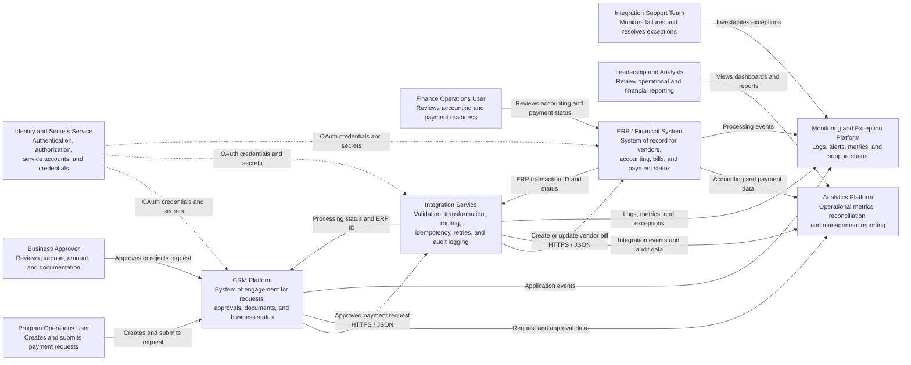

# System Context: Enterprise Payment Integration

## Purpose

This diagram shows the people and systems involved in a fictional payment-request process for **Northstar Community Foundation**.

The design is intentionally vendor-neutral. The CRM, ERP, integration, identity, monitoring, and analytics components can be implemented using commercial platforms, cloud services, custom applications, or a combination of technologies.

## Business Context

Northstar Community Foundation uses several systems to manage payment requests:

- Program staff initiate and approve payment requests in the CRM.
- Finance manages accounting, controls, and payment processing in the ERP.
- An integration service validates and transfers approved requests.
- Support teams monitor failures and resolve exceptions.
- Leadership reviews payment and operational metrics in an analytics platform.

## System-Context Diagram

## Primary Responsibilities

| Actor or System | Primary Responsibility |
|---|---|
| Program Operations User | Creates the payment request and supplies business justification and documentation |
| Business Approver | Confirms that the payment is authorized and appropriate |
| Finance Operations User | Manages accounting, payment processing, and financial exceptions |
| CRM Platform | Owns the business request, approval history, and user-facing status |
| Integration Service | Validates, transforms, routes, retries, and traces integration transactions |
| ERP / Financial System | Owns vendor accounting records, bills, payment records, and financial status |
| Identity and Secrets Service | Protects credentials and controls system access |
| Monitoring and Exception Platform | Centralizes logs, alerts, failures, and support workflows |
| Analytics Platform | Combines operational and financial information for reporting and reconciliation |

## System-of-Record Boundaries

| Data Domain | System of Record |
|---|---|
| Payment request and business justification | CRM |
| Approval history | CRM |
| Vendor accounting record | ERP |
| General ledger coding | ERP |
| Vendor bill | ERP |
| Payment execution and accounting status | ERP |
| Integration processing status | Integration Service |
| Cross-system audit and monitoring events | Monitoring Platform |
| Consolidated reporting metrics | Analytics Platform |

## Trust Boundaries

The architecture contains several important trust boundaries:

1. **User-to-application boundary**  
   Users authenticate through the organization's identity provider and receive role-based access.

2. **CRM-to-integration boundary**  
   The CRM sends only approved requests. The integration service independently validates each request.

3. **Integration-to-ERP boundary**  
   The integration service uses a dedicated service account with least-privilege permissions.

4. **Operational-data-to-analytics boundary**  
   Sensitive fields are masked or excluded before data is loaded into the analytics platform.

## Key Design Decisions

- The CRM owns the business workflow; the ERP owns the financial transaction.
- The integration service does not assume that an HTTP success response proves business completion.
- Every request uses a stable external ID to prevent duplicates.
- Business status and technical processing status are stored separately.
- Financial reconciliation is performed independently of API processing.
- Credentials are stored outside source code.
- Failures that cannot be resolved automatically are routed to an exception queue.

## Related Workflow

See [CRM-to-ERP Payment Request](../workflows/crm-to-erp-payment-request.md) for the detailed sequence, sample payload, validation rules, and exception paths.
