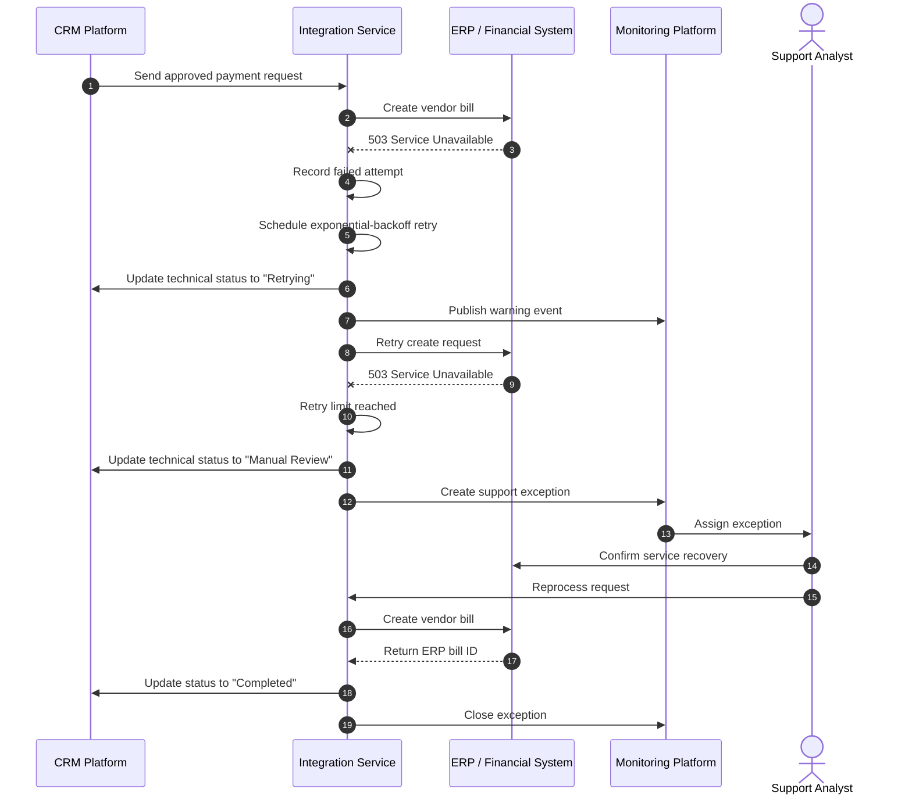

# Workflow: CRM-to-ERP Payment Request

## Overview

This workflow demonstrates how an approved payment request moves from a fictional CRM into an ERP as a vendor bill.

The scenario is designed to show practical enterprise-integration concerns:

- Business approval
- Data ownership
- Validation
- Idempotency
- API-based processing
- Status synchronization
- Error handling
- Auditability
- Reconciliation

All organizations, systems, records, and values are fictional.

## Fictional Scenario

A program manager at **Northstar Community Foundation** requests a **$12,500** payment to **Harbor Youth Services** for an approved community program.

The request is entered and approved in the CRM. After approval, the integration service validates the request and creates a vendor bill in the ERP.

## Workflow Preconditions

Before the payment request can be processed:

- The request must be approved in the CRM.
- The payee must have an active ERP vendor ID.
- The payee must be marked payable.
- Required accounting dimensions must be present.
- The amount must be greater than zero.
- Supporting documentation must be attached.
- The request must have a stable external ID.
- The request must not already exist in the ERP.

## Happy-Path Sequence

```mermaid
sequenceDiagram
    autonumber

    actor User as Program Operations User
    participant CRM as CRM Platform
    participant INT as Integration Service
    participant ERP as ERP / Financial System
    participant MON as Monitoring Platform
    participant DWH as Analytics Platform

    User->>CRM: Create payment request
    CRM->>CRM: Validate required business fields
    User->>CRM: Submit for approval
    CRM->>CRM: Record approval decision

    CRM->>INT: POST approved payment request
    INT->>INT: Authenticate request
    INT->>INT: Validate schema and business rules
    INT->>INT: Check idempotency key

    INT->>ERP: Query vendor and external ID
    ERP-->>INT: Vendor active; request not found

    INT->>ERP: Create vendor bill
    ERP-->>INT: Return bill ID and status

    INT->>INT: Write integration audit record
    INT->>CRM: Update request with ERP bill ID
    CRM-->>User: Display "Created in ERP"

    INT->>MON: Publish success metric and trace
    CRM->>DWH: Publish request and approval data
    ERP->>DWH: Publish bill and payment data
    INT->>DWH: Publish integration audit data
```

## Process Steps

| Step | Owner | Action | Result |
|---:|---|---|---|
| 1 | Program Operations User | Creates a payment request in the CRM | Request is saved as `Draft` |
| 2 | CRM | Validates required business fields | Invalid requests cannot be submitted |
| 3 | Business Approver | Approves the request | Business status becomes `Approved` |
| 4 | CRM | Sends the approved request to the integration service | Technical status becomes `Queued` |
| 5 | Integration Service | Validates schema, business rules, mappings, and external ID | Request is accepted or rejected |
| 6 | Integration Service | Checks whether the external ID already exists | Duplicate vendor bills are prevented |
| 7 | ERP | Creates the vendor bill | ERP returns its internal transaction ID |
| 8 | Integration Service | Stores audit details and updates the CRM | CRM receives the ERP ID and processing result |
| 9 | Monitoring Platform | Records metrics and failures | Support teams have operational visibility |
| 10 | Analytics Platform | Combines request, bill, and audit data | Dashboards and reconciliation reports are updated |

## Example CRM Request

```json
{
  "payment_request_id": "PAY-2026-00481",
  "correlation_id": "31ed5e48-df47-4e8f-8d8c-261916cd942a",
  "request_status": "Approved",
  "payee": {
    "crm_account_id": "ACC-10492",
    "legal_name": "Harbor Youth Services",
    "erp_vendor_id": "VEND-3814",
    "payability_status": "Payable"
  },
  "payment": {
    "amount": 12500.00,
    "currency": "USD",
    "requested_payment_date": "2026-08-15",
    "memo": "Community program installment 2 of 4"
  },
  "accounting": {
    "subsidiary_code": "NSCF",
    "department_code": "PROGRAMS",
    "program_code": "YOUTH-ACCESS",
    "expense_account": "6100"
  },
  "approval": {
    "approved_by": "USR-2207",
    "approved_at": "2026-08-10T18:42:12Z"
  },
  "documents": [
    {
      "document_id": "DOC-78145",
      "document_type": "Approval Letter"
    }
  ]
}
```

## Example Integration Response

```json
{
  "payment_request_id": "PAY-2026-00481",
  "correlation_id": "31ed5e48-df47-4e8f-8d8c-261916cd942a",
  "processing_status": "Completed",
  "erp_transaction": {
    "transaction_type": "VendorBill",
    "internal_id": "984215",
    "document_number": "VB-2026-10874",
    "status": "Pending Approval"
  },
  "processed_at": "2026-08-10T18:42:15Z"
}
```

## Validation Rules

### Request Validation

| Rule | Failure Code |
|---|---|
| `payment_request_id` is required | `MISSING_REQUEST_ID` |
| Request status must equal `Approved` | `REQUEST_NOT_APPROVED` |
| Amount must be greater than zero | `INVALID_AMOUNT` |
| Currency must be supported | `UNSUPPORTED_CURRENCY` |
| ERP vendor ID is required | `MISSING_VENDOR_MAPPING` |
| Payability status must equal `Payable` | `PAYEE_NOT_PAYABLE` |
| Subsidiary, department, program, and account must be valid | `INVALID_ACCOUNTING_MAPPING` |
| At least one supporting document is required | `MISSING_DOCUMENTATION` |
| Approval timestamp must be present | `MISSING_APPROVAL` |

### Idempotency Rule

The `payment_request_id` is used as the ERP external ID.

Before creating a vendor bill, the integration service searches for an existing transaction with:

```text
external_id = CRM-PAY-2026-00481
```

If a matching transaction exists, the service returns the existing ERP transaction rather than creating a duplicate.

## Status Model

Business status and technical status are stored separately.

### CRM Business Status

```text
Draft
Submitted
Approved
Rejected
Cancelled
```

### Integration Processing Status

```text
Not Started
Queued
Validating
Processing
Completed
Retrying
Failed
Manual Review
```

### ERP Financial Status

```text
Pending Approval
Open
Scheduled for Payment
Paid
Voided
```

## Status Mapping

| Integration Event | CRM Business Status | CRM Technical Status | ERP Status |
|---|---|---|---|
| Request approved | Approved | Queued | Not created |
| Validation started | Approved | Validating | Not created |
| Vendor bill created | Approved | Completed | Pending Approval |
| Temporary ERP outage | Approved | Retrying | Not created or unchanged |
| Invalid accounting mapping | Approved | Manual Review | Not created |
| Bill paid | Approved | Completed | Paid |
| Request cancelled before creation | Cancelled | Completed | Not created |

## Failure and Exception Paths

### Temporary ERP Failure



### Permanent Validation Failure

A permanent validation failure is not retried automatically.

Example response:

```json
{
  "payment_request_id": "PAY-2026-00481",
  "correlation_id": "31ed5e48-df47-4e8f-8d8c-261916cd942a",
  "processing_status": "Manual Review",
  "error": {
    "code": "INVALID_ACCOUNTING_MAPPING",
    "message": "Program code YOUTH-ACCESS is not valid for subsidiary NSCF."
  },
  "failed_at": "2026-08-10T18:42:14Z"
}
```

The CRM displays the error to the responsible business or finance user. After the mapping is corrected, the request can be resubmitted using the same payment-request ID.

## Retry Policy

| Attempt | Delay |
|---:|---:|
| 1 | Immediate |
| 2 | 1 minute |
| 3 | 5 minutes |
| 4 | 15 minutes |
| 5 | 1 hour |

After the final failed attempt, the transaction moves to `Manual Review`.

Automatic retries should be limited to failures such as:

- Network timeouts
- HTTP `429`
- HTTP `502`
- HTTP `503`
- Temporary record locks

Validation errors and authorization failures should not be retried without corrective action.

## Audit Record

Each processing attempt should create an immutable audit event.

```json
{
  "event_id": "EVT-8b7b7d19",
  "correlation_id": "31ed5e48-df47-4e8f-8d8c-261916cd942a",
  "source_system": "CRM",
  "source_record_id": "PAY-2026-00481",
  "target_system": "ERP",
  "target_record_id": "984215",
  "operation": "CREATE_VENDOR_BILL",
  "attempt_number": 1,
  "result": "SUCCESS",
  "occurred_at": "2026-08-10T18:42:15Z"
}
```

Sensitive information should not be included in integration logs.

## Reconciliation Controls

A successful API response is not the final control.

The following reconciliation checks should run daily:

| Control | Description |
|---|---|
| Approved requests without ERP IDs | Identifies CRM requests that did not create financial transactions |
| ERP bills without CRM external IDs | Identifies transactions created outside the intended integration |
| Duplicate external IDs | Detects duplicate or incorrectly reused request identifiers |
| Amount comparison | Confirms that the CRM request amount equals the ERP bill amount |
| Currency comparison | Confirms that both systems use the same transaction currency |
| Status comparison | Identifies requests whose CRM and ERP statuses are inconsistent |
| Count and total comparison | Compares daily record counts and total amounts between systems |

## Security Controls

- Use OAuth or another short-lived token mechanism.
- Store credentials in a managed secrets service.
- Use a dedicated integration service account.
- Restrict the service account to required objects and operations.
- Encrypt all traffic using TLS.
- Validate request signatures or trusted application identity.
- Mask confidential information in logs.
- Retain audit records according to policy.
- Alert on repeated authentication or authorization failures.

## Acceptance Criteria

The workflow is complete when:

- An approved CRM request creates exactly one ERP vendor bill.
- The ERP internal ID is stored on the CRM request.
- Duplicate submissions do not create duplicate bills.
- Invalid requests are rejected with actionable errors.
- Temporary failures are retried automatically.
- Exhausted retries create a support exception.
- Every processing attempt has a correlation ID and audit event.
- Daily reconciliation detects missing, duplicate, or mismatched transactions.
- No credentials or sensitive production data appear in the repository.

## Portfolio Talking Points

This workflow demonstrates the ability to:

- Translate a business process into a technical integration design
- Define systems of record and ownership boundaries
- Model synchronous and asynchronous behavior
- Prevent duplicate financial transactions
- Separate business, technical, and financial statuses
- Design retry and exception-management processes
- Include security, auditability, and reconciliation from the beginning
- Communicate architecture to technical and nontechnical audiences

## Related Architecture

See [Enterprise Payment Integration System Context](../architecture/system-context.md).
